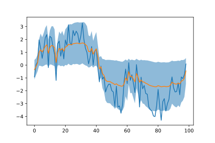

# A experiment about dropout variational inference on RNN

Here I use dropout as a variational inference method to infer uncertainly in RNN prediction. It's strange that paper "A theoretically grounded application of dropout in recurrent neural networks" show the setting improving traditional index but not showing its application on uncertainly estimation.

A toy example is employed to illustrate the performance. Consider a dataset, 
a distribution over sequence defined by:

```
x[t] = sum(beta * x[t-5:t]) + e[t]
e[t] ~ N(0,1)
```

Use a dropout-LSTM to predict with 3-sigma:



If we set `e[t] ~ N(0,0.1)` instead of `e[t] ~ N(0,1)`, we can get:


Note dropout-LSTM automatic adjust its scale even though we don't specify a
term to denote "global uncertainly".

Full example can be seen in notebook [example.ipynb](example.ipynb)

## References

* Gal, Yarin, and Zoubin Ghahramani. "A theoretically grounded application of dropout in recurrent neural networks." Advances in neural information processing systems (2016): 1019-1027.
* Gal, Yarin, and Zoubin Ghahramani. "Dropout as a bayesian approximation: Representing model uncertainty in deep learning." international conference on machine learning. 2016.
